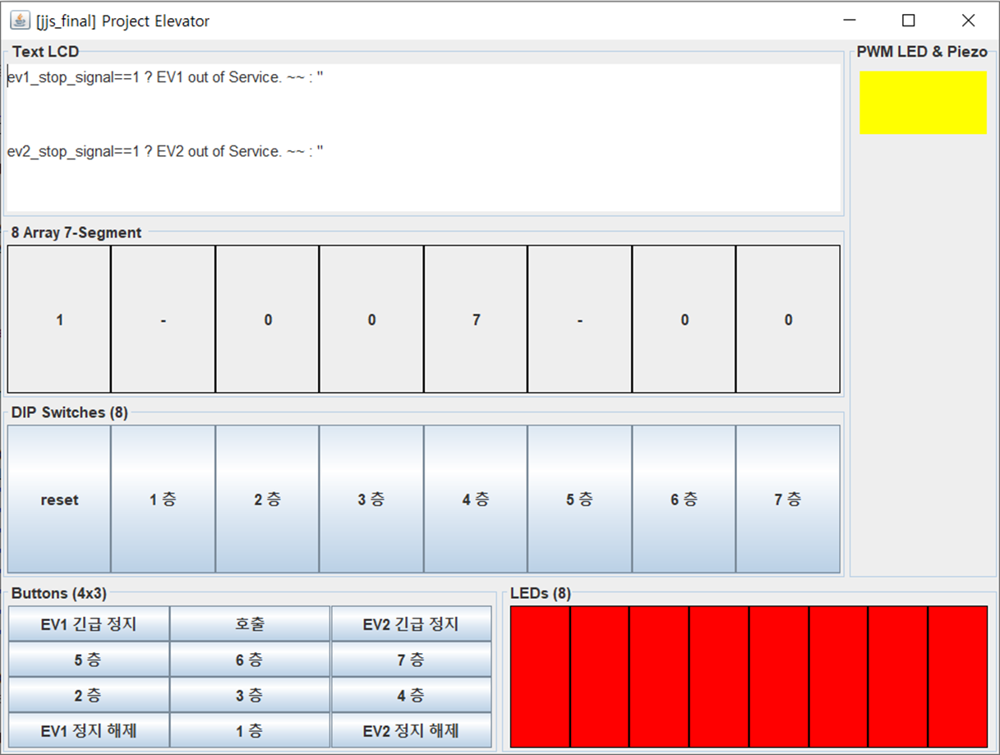
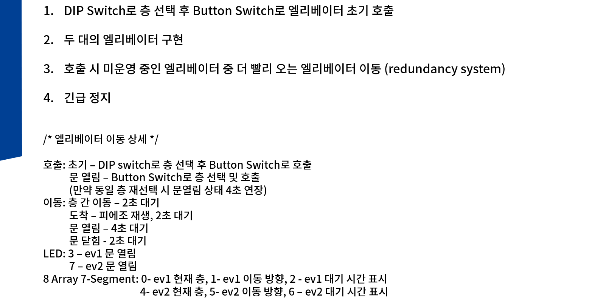
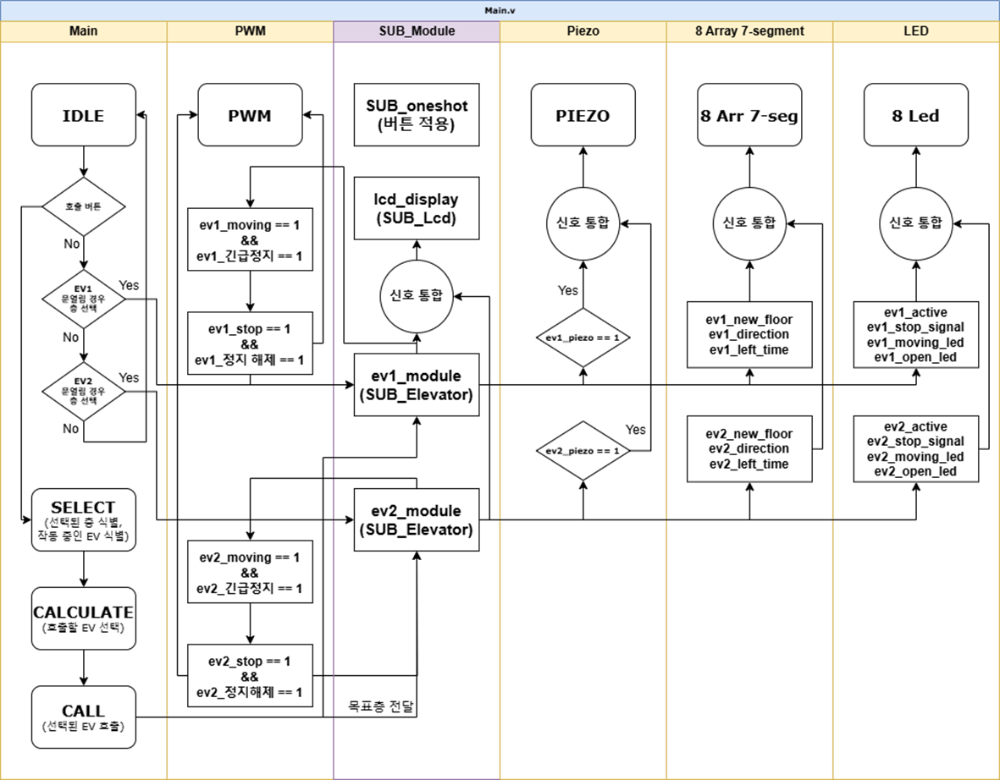
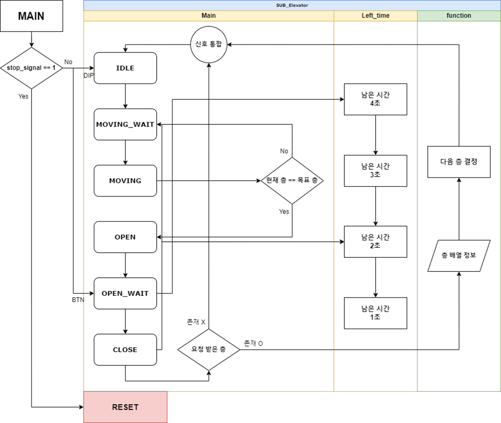

**코드를 개선하셨나요? 그렇다면 PR을 올려주시면 정말 감사하겠습니다! 🎉  
다른 학우분들에게 더 큰 도움이 될 수 있게 함께 발전시켜나가요. 🙌**
---

# 1. 프로젝트 소개

**서울시립대학교 전자전기컴퓨터공학부**  
2학년 2학기 전공필수 과목 **[전자전기컴퓨터설계실험 II]** 의 파이널 프로젝트 관련 자료입니다.

2024년 **박병은 교수님** 분반에서 수행한 **엘리베이터 구현** 과제의 결과물입니다.  
이 자료가 후배 여러분들에게 도움이 되기를 바랍니다. 💡

### 📌 세부 내용은 다음과 같습니다

- 교안에서 제시된 **기본 기능**과 조교님이 추가로 요구한 **추가 기능**을 모두 구현하였습니다.
- 취득 성적은 **A+**(분반 1등) 이고, 당시 해당 과제를 수행한 분반 중 제가 가장 많은 기능을 구현했다고 알고 있습니다.
- 참고: [**엘리베이터 작동 영상 (Youtube)**](https://youtu.be/zXFPrybYyzI)

# 2. 기능 설명
### ㄱ. 하드웨어 매핑
Verilog에 대한 이해도 및 숙련도가 부족하다고 판단했기 때문에,  
**JAVA로 기능을 먼저 구현**한 후, 이를 **Verilog로 Migration** 하는 방식을 택했습니다.

아래 figure는 JAVA로 기능을 구현하는 과정에서 제작한 **GUI 이미지**입니다. 

해당 figure를 참고하면 이해하는 데 도움이 될 거라 생각합니다.

### ㄴ. 기본 기능 구현
교안에서 제시했던 모든 **기본 기능**에 대한 구현이 완료되어 있습니다.

### ㄷ. 추가 기능 구현
조교님께서 요구하신 **추가 기능**과 기타 **심화 기능**까지 모두 구현했습니다.  

# 3. 코드 설명
코드 이해가 어려울 거라 생각되어, **FlowChart**를 첨부합니다.  
기타 다른 모듈(Oneshot, LCD 등)들은 기존 과제에서 활용된 코드를 재사용하였습니다.

### ㄱ. Main Module
해당 모듈에서 모든 Sub Module을 통합하고 제어합니다.
- LCD를 제외한 모든 출력 관련 처리는 해당 모듈에서 수행합니다.

### ㄴ. SUB_Elevator Module
엘리베이터가 각각 독립적으로 동작할 수 있도록 설계하였습니다.  
- **멀티스레드와 유사한 개념**을 Verilog에서 구현하기 위해 **SUB 모듈**로 분리하였습니다. 

